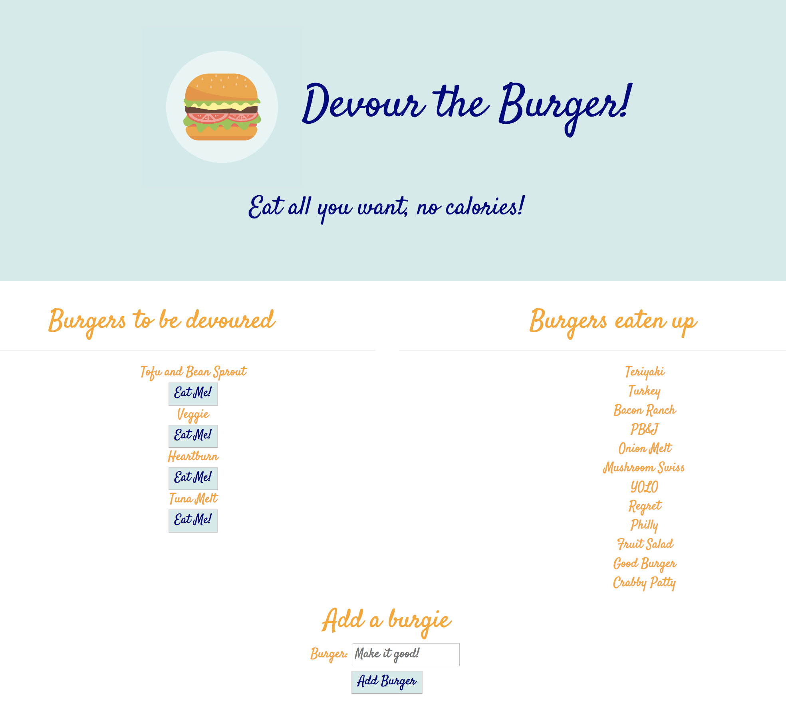

# burger

Welcome to [Eat the Burgers](https://lit-tundra-84738.herokuapp.com/burgers)!

This app utilizes the [MVC](https://developer.mozilla.org/en-US/Apps/Fundamentals/Modern_web_app_architecture/MVC_architecture) (Model, View, & Controller) architecture pattern.  It was made using an ORM(Object Relational Mapper) which defined several methods to use within our app to access data from our mySQL database.  Read more about ORMs [here](https://en.wikipedia.org/wiki/Object-relational_mapping). The views are executed with a templating library called [Handlebars](https://handlebarsjs.com/).  Other technologies for this app include Node, and npm packages like mySQL, and Express. 

Eat the Burgers lets you devour burgers and create new ones to devour.  

